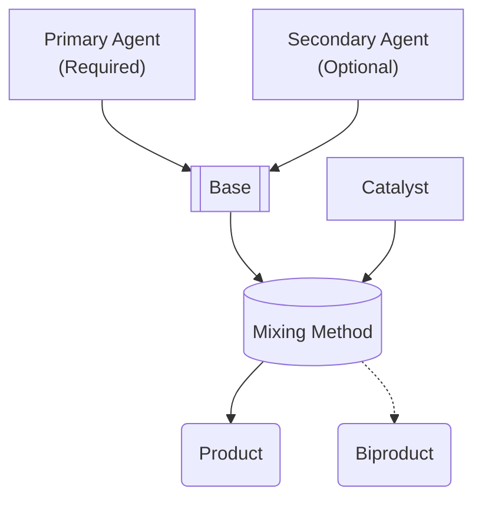

# ⚗️ Alchemy

The topic of Alchemy is barely touched upon in D&D, relegated to a simple check and some time. Let's make it more interesting! 🤓

Althrough not nescessarily required, as all classes can _technically_ do alchemy, being an Alchemist (a subclass of Artificer) really does help.

## Alchemist Benefits

- All checks are done with advantage.
- Process is done in half the time.
- Level 10 Alchemists double their output.

## Potions & Poisons

To create either a potion or poison requires the following components:

- **Base:** Delivery method and detectability.
- **Agent(s):** Up to two can be used, each providing an effect.
  - If two of the same agent are used, they may have an additional effect! See the ingredients table below for "concentrated" effects.
- **Catalyst:** Save DC and metabolization period.

The mixing method that you choose to create the potion with affects the efficiency (how much is produced) and potency (how much healing/damage it does) of the product.

### Creation

### Mixing Methods

All mixing methods require the use of <a href="https://www.dndbeyond.com/equipment/alchemists-supplies" target="_blank">🐉 Alchemist's Supplies</a>, in addition to any requirements listed below.

|       Name       |                       Requirements                        | Efficiency | Potency |                        Dangers                         |
| :--------------: | :-------------------------------------------------------: | :--------: | :-----: | :----------------------------------------------------: |
|     Boiling      |                           None                            |    x0.5    |  x0.5   |                          None                          |
|     Blending     |                  Dexterity check (DC 10)                  |    x0.5    |   x1    |                          None                          |
|  Emulsification  |                Intelligence check (DC 10)                 |     x1     |  x0.5   |                          None                          |
| Pressure Boiling |               Advanced Alchemist's Supplies               |     x1     |   x1    |                          None                          |
|    Titration     |  Advanced Alchemist's Supplies, Dexterity check (DC 15)   |     x2     |   x1    | Destroy Advanced Alchemist's Supplies on critical fail |
|   Electrolysis   | Advanced Alchemist's Supplies, Intelligence check (DC 15) |     x1     |   x2    |        10d10 lightning damage on critical fail         |

### Ingredients

#### Bases

|       Name        | Delivery Method |    Detectability    |
| :---------------: | :-------------: | :-----------------: |
|    🐝 Beeswax     |   Transdermal   | DC 5 Medical check  |
| 🩸 Monster Blood  |    Injection    | DC 10 Medical check |
| 💧 Purified Water |    Ingestion    | DC 15 Medical check |
|   🧂 Fine Salt    |   Inhalation    | DC 20 Medical check |
|   💨 Fairy Dust   |   Inhalation    | DC 25 Medical check |
|  💦 Troll Sweat   |    Ingestion    | DC 30 Medical check |

#### Agents

##### Healing

|    Name    |       Effect        |   Concentrated    |  Rarity   |
| :--------: | :-----------------: | :---------------: | :-------: |
|    Rose    |     1d6 Healing     |         -         |  Common   |
|    Lily    |     1d6 Healing     |    2d6 Healing    | Uncommon  |
|    Iris    |     1d8 Healing     |    2d8 Healing    |   Rare    |
|    Ivy     |     4d6 Healing     |    8d6 Healing    | Very Rare |
|    Oak     | Lesser Restoration  |         -         |  Common   |
| Heartbloom | Greater Restoration |         -         |   Rare    |
| Livingsap  |  1d12 Temporary HP  | 2d12 Temporary HP | Uncommon  |

##### Damage

|      Name       |       Effect        |    Concentrated     |  Rarity   |
| :-------------: | :-----------------: | :-----------------: | :-------: |
|    Blaysting    |   1d8 Fire Damage   |   2d8 Fire Damage   | Uncommon  |
|    Bluebell     |   1d8 Cold Damage   |   2d8 Cold Damage   | Uncommon  |
|     Hemlock     |  1d8 Poison Damage  |  2d8 Poison Damage  | Uncommon  |
|    Mandrake     | 1d8 Psychic Damage  | 2d8 Psychic Damage  |   Rare    |
| Stinging Nettle |   1d8 Acid Damage   |   2d8 Acid Damage   | Uncommon  |
|    Sunflower    | 1d8 Radiant Damage  | 2d8 Radiant Damage  |   Rare    |
|   Nightshade    | 1d8 Necrotic Damage | 2d8 Necrotic Damage | Very Rare |
|    Lavender     | 1d8 Thunder Damage  | 2d8 Thunder Damage  | Uncommon  |
|    Marigold     |  1d8 Force Damage   |  2d8 Force Damage   | Uncommon  |

##### Buffs

|     Name     |            Effect             |      Concentrated       |  Rarity   |
| :----------: | :---------------------------: | :---------------------: | :-------: |
|    Basil     |       1d4 to next save        |    1d8 to next save     | Uncommon  |
|   Cilantro   |    1d4 to next attack hit     | 2d4 to next attack hit  | Uncommon  |
|    Ginger    |      Cannot be surprised      |            -            |   Rare    |
| Spicy Pepper |      Frightened immunity      |            -            | Very Rare |
|  Raw Garlic  |       Charmed immunity        |            -            | Very Rare |
|    Carrot    |        60ft Darkvision        |    120ft Darkvision     | Uncommon  |
|   Cucumber   | Next heal received is doubled |            -            |   Rare    |
|   Parsley    |    1d4 to next skill check    | 1d8 to next skill check | Uncommon  |

#### Catalysts

|      Name      | Save DC | Metabolization Period |
| :------------: | :-----: | :-------------------: |
|    Lemonade    |    5    |       Instantly       |
|  Citric Acid   |   10    |       6 seconds       |
|    Vinegar     |   12    |       1 minute        |
| Sulfuric Acid  |   15    |        1 hour         |
|      Iron      |   20    |         1 day         |
| Steel Shavings |   25    |        1 week         |

### Biproducts

Roll a d100 and use this table to decide the biproduct of your alchemy:

|  D100  |                      Biproduct                       |
| :----: | :--------------------------------------------------: |
|  1-5   | Toxic gas that deals 5d10 poison in a 20 foot radius |
|  6-94  |                       Nothing                        |
| 95-100 |                 1x vial of Pure Viss                 |
